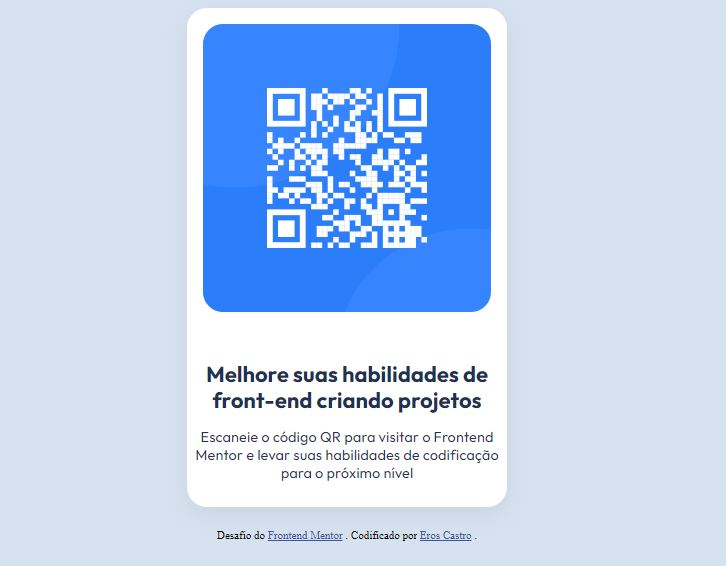

# Frontend Mentor - QR code component solution

This is a solution to the [QR code component challenge on Frontend Mentor](https://www.frontendmentor.io/challenges/qr-code-component-iux_sIO_H). Frontend Mentor challenges help you improve your coding skills by building realistic projects. 

## Table of contents

- [Overview](#overview)
  - [Screenshot](#screenshot)
- [My process](#my-process)
  - [Built with](#built-with)
  - [What I learned](#what-i-learned)
  - [Continued development](#continued-development)

## Overview

### Screenshot

## My process

### Built with

- Semantic HTML5 markup
- CSS custom properties

### What I learned

Este é o primeiro código que escrevo, e me ative à estrutura do código, aprendendendo que escrever o CSS correndo a página de cima para baixo auxilia na revisão e organização.  

### Continued development

Todavia estou aprendendo CSS, então ainda tenho uma jornada de aprendizados pela frente, certamente.

